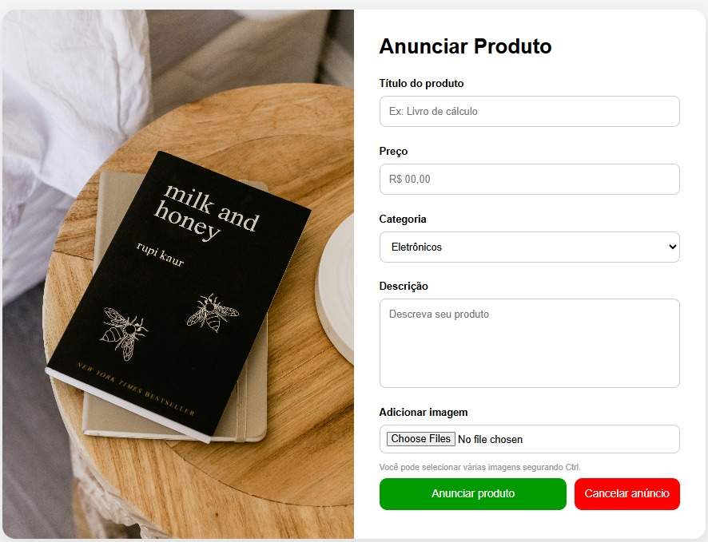
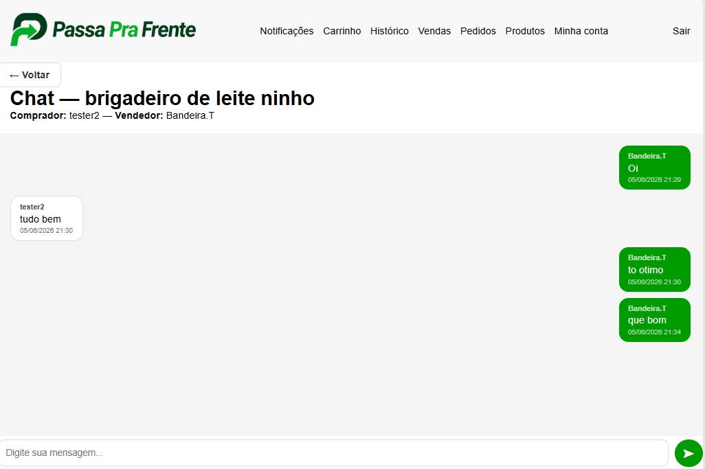
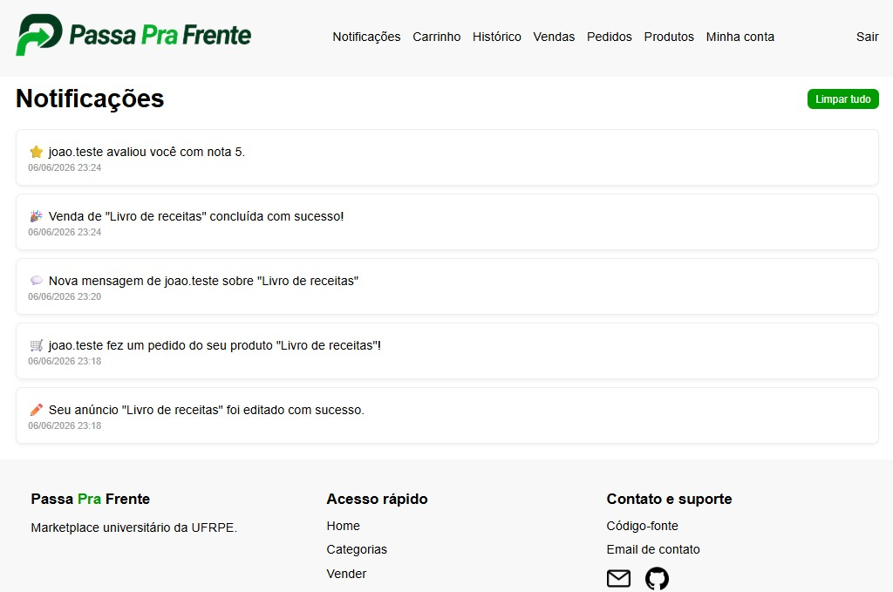
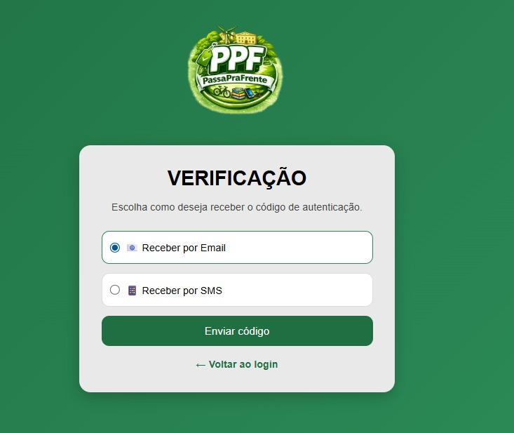

# ♻️ PassaPraFrente

PassaPraFrente é um marketplace desenvolvido com Django que permite a compra, venda e doação de produtos entre usuários de forma simples e organizada.

O sistema foi criado com foco em reutilização de itens, economia colaborativa e facilidade de comunicação entre compradores e vendedores.

---

## 🚀 Release 3.0

### 👤 Gerenciamento de Usuários
- Cadastro de usuários
- Login e logout
- Recuperação de senha
- Verificação por código
- Autenticação em duas etapas (2FA)
- Edição de perfil

### 📦 Produtos
- Cadastro de produtos
- Upload de múltiplas imagens
- Edição de anúncios
- Exclusão de anúncios
- Visualização detalhada dos produtos
- Sistema de denúncias

### 🛒 Pedidos
- Criação de pedidos
- Controle de status dos pedidos
- Histórico de negociações
- Cancelamento e confirmação de pedidos

### 💬 Comunicação
- Sistema de mensagens entre usuários
- Conversas relacionadas aos pedidos

### ⭐ Avaliações
- Feedback entre usuários
- Sistema de avaliação após a conclusão da negociação

### 🔔 Notificações
- Central de notificações
- Avisos sobre alterações em pedidos
- Novas mensagens e atualizações do sistema

---

## 🏗️ Estrutura do Projeto

```text
passaprafrente/
├── accounts/        # Autenticação e gerenciamento de usuários
├── produtos/        # Cadastro e gerenciamento de produtos
├── pedidos/         # Pedidos, mensagens e feedbacks
├── notificacoes/    # Sistema de notificações
├── templates/       # Templates HTML
├── static/          # Arquivos estáticos (CSS, JS e imagens)
├── media/           # Uploads dos usuários
└── passaprafrente/  # Configurações do projeto Django
```

---

## 🛠️ Tecnologias Utilizadas

- Python
- Django
- SQLite
- HTML5
- CSS3
- JavaScript
- Pillow

---

## 📚 Bibliotecas Utilizadas

O PassaPraFrente foi desenvolvido utilizando bibliotecas nativas do Python e bibliotecas externas que auxiliam na construção da aplicação, autenticação, comunicação e integração com serviços externos.

### Django

Framework web utilizado como base do projeto. Responsável pelo gerenciamento de rotas, templates, banco de dados, autenticação de usuários e estrutura geral da aplicação.

**Principais usos no projeto:**
- Sistema de autenticação
- ORM para manipulação do banco de dados
- Renderização de páginas HTML
- Controle de permissões
- Gerenciamento de sessões

---

### Pillow

Biblioteca utilizada para processamento de imagens.

**Principais usos no projeto:**
- Upload de fotos dos produtos
- Manipulação de imagens
- Redimensionamento e validação de arquivos enviados pelos usuários

---

### python-dotenv

Biblioteca responsável pelo carregamento de variáveis de ambiente armazenadas em arquivos `.env`.

**Principais usos no projeto:**
- Armazenamento seguro de credenciais
- Configuração de chaves secretas
- Configuração de APIs externas

---

### Twilio

Serviço utilizado para envio de mensagens SMS.

**Principais usos no projeto:**
- Autenticação em dois fatores (2FA)
- Envio de códigos de verificação
- Confirmação de identidade do usuário

---

### PyJWT

Biblioteca para geração e validação de tokens JWT (JSON Web Tokens).

**Principais usos no projeto:**
- Criação de tokens de autenticação
- Validação de sessões
- Compartilhamento seguro de informações entre cliente e servidor

---

### Requests

Biblioteca utilizada para realizar requisições HTTP de forma simples.

**Principais usos no projeto:**
- Consumo de APIs externas
- Comunicação com serviços de terceiros
- Consulta e envio de dados via HTTP

---

### Groq

SDK oficial da plataforma Groq para integração com modelos de Inteligência Artificial.

**Principais usos no projeto:**
- Recursos baseados em IA
- Processamento de linguagem natural
- Integração com modelos generativos

---

### Pydantic

Biblioteca utilizada para validação e tipagem de dados.

**Principais usos no projeto:**
- Validação de entradas
- Estruturação de dados recebidos por APIs
- Garantia de consistência das informações

---

### HTTPX

Cliente HTTP moderno para Python com suporte a operações síncronas e assíncronas.

**Principais usos no projeto:**
- Comunicação com APIs externas
- Requisições assíncronas
- Integração com serviços remotos

---

### aiohttp

Biblioteca para criação e consumo de serviços HTTP assíncronos.

**Principais usos no projeto:**
- Requisições assíncronas
- Melhoria de desempenho em integrações externas
- Comunicação simultânea com múltiplos serviços

---

### aiohttp-retry

Extensão do aiohttp que permite repetir automaticamente requisições que falharam.

**Principais usos no projeto:**
- Tratamento de falhas temporárias de rede
- Aumento da confiabilidade das integrações
- Reenvio automático de requisições

---

## 🐍 Bibliotecas Nativas do Python

Além das bibliotecas externas, o projeto utiliza diversos módulos nativos da linguagem Python.

| Biblioteca | Finalidade |
|------------|------------|
| os | Manipulação de arquivos e diretórios |
| datetime | Tratamento de datas e horários |
| random | Geração de valores aleatórios |
| secrets | Geração segura de códigos e tokens |
| string | Manipulação de textos |
| uuid | Geração de identificadores únicos |
| json | Manipulação de dados JSON |
| re | Expressões regulares |
| pathlib | Manipulação moderna de caminhos de arquivos |
| logging | Registro de logs da aplicação |
| smtplib | Envio de e-mails |
| email | Construção e tratamento de mensagens de e-mail |
| hashlib | Geração de hashes |
| base64 | Codificação e decodificação de dados |

## ⚙️ Funcionalidades elaboradas e seus objetivos

---

### ✅ Funcionalidades entregues na versão 1.0 — Primeira VA

As funcionalidades da Primeira VA foram organizadas para oferecer uma experiência inicial completa ao usuário, permitindo o cadastro na plataforma, autenticação e gerenciamento básico dos produtos anunciados.

---

### ✅ Funcionalidades entregues na versão 2.0 — Segunda VA

A Segunda VA teve como foco a evolução da plataforma para um ambiente de negociações mais seguro e completo, adicionando recursos que permitem acompanhar compras, avaliar usuários e gerenciar pedidos.

#### 🏗️ Migração para Django
- Reestruturação completa do projeto utilizando o framework Django.
- Implementação do padrão MVT (Model-View-Template).
- Integração com banco de dados através da ORM do Django.

#### 📚 Programação Orientada a Objetos (POO)
- Organização do sistema em classes e modelos.
- Melhor reutilização e manutenção do código.
- Maior escalabilidade da aplicação.

#### ✅ Confirmação de Compra
- Sistema de confirmação para finalizar negociações.
- Controle do status dos pedidos.
- Maior segurança para comprador e vendedor.

#### ⭐ Avaliação de Usuários
- Possibilidade de avaliar o vendedor após a conclusão da compra.
- Sistema de feedback para aumentar a confiabilidade da plataforma.
- Exibição da reputação dos usuários.

#### 🚨 Sistema de Denúncias
- Permite reportar anúncios ou comportamentos inadequados.
- Auxilia na moderação da plataforma.
- Contribui para um ambiente mais seguro.

#### 📜 Histórico de Atividades
- Histórico de pedidos realizados.
- Histórico de compras efetuadas.
- Histórico de avaliações e feedbacks recebidos.

#### 🛒 Carrinho de Compras
- Adição de múltiplos produtos ao carrinho.
- Organização dos itens antes da confirmação da compra.
- Melhor experiência de navegação e compra.

---

### ✅ Funcionalidades entregues na versão 3.0 — Terceira VA

A Terceira VA teve como objetivo aprimorar a comunicação entre os usuários, fortalecer a segurança da plataforma e incorporar recursos de Inteligência Artificial para auxiliar nas negociações e recomendações de produtos.

#### 💬 Sistema de Chat

* Implementação de um chat entre comprador e vendedor.
* Comunicação direta durante o processo de negociação.
* Centralização das mensagens dentro da plataforma.

#### 🤖 Integração com Inteligência Artificial (Groq)

* Utilização de modelos de linguagem (LLMs) através da API da Groq.
* Recomendação personalizada de produtos com base nos interesses do usuário.
* Análise das conversas para identificação de possíveis tentativas de golpe ou comportamentos suspeitos.
* Auxílio na promoção de negociações mais seguras.

#### 🔔 Mural de Notificações

* Centralização de notificações do sistema em um único local.
* Avisos sobre novas mensagens recebidas.
* Atualizações relacionadas aos pedidos e produtos.
* Melhor acompanhamento das atividades da plataforma.

#### 📧 Notificações por E-mail

* Envio automático de e-mails para eventos importantes.
* Comunicação da aceitação de pedidos.
* Confirmação da conclusão de negociações.
* Maior transparência durante o processo de compra e venda.

#### 🔑 Recuperação de Senha

* Implementação da funcionalidade "Esqueci minha senha".
* Envio de código de verificação para o e-mail cadastrado.
* Processo seguro para redefinição de credenciais.

#### 🛡️ Autenticação em Dois Fatores (2FA)

* Camada adicional de segurança para acesso à conta.
* Envio de códigos de autenticação por e-mail.
* Possibilidade de envio por SMS para o telefone cadastrado.
* Redução do risco de acessos não autorizados.

---

## 📸 Capturas de Tela

### 🏠 Menu Principal


### 📦 Anunciar Produto



### 💬 Chat



### 🔔 Mural de Notificações



### 🛡️ Autenticação em Dois Fatores



## ⚙️ Instalação

### 1. Clone o repositório

```bash
git clone https://github.com/TarykMelo/PassaPraFrente-django.git
cd PassaPraFrente-django
```

### 2. Crie e ative um ambiente virtual

Windows:

```bash
python -m venv venv
venv\Scripts\activate
```

Linux/macOS:

```bash
python3 -m venv venv
source venv/bin/activate
```

### 3. Instale as dependências

```bash
pip install -r requirements.txt
```

### 4. Execute as migrações

```bash
python manage.py migrate
```

### 5. Inicie o servidor

```bash
python manage.py runserver
```

### 6. Acesse o sistema

```text
http://127.0.0.1:8000/
```

---

## 📊 Modelos Principais

### Accounts
- Usuario
- CodigoVerificacao

### Produtos
- Produto
- ImagemProduto
- Denuncia

### Pedidos
- Pedido
- Feedback
- Mensagem

### Notificações
- Notificacao

---

## 🎯 Objetivos

- Incentivar a reutilização de produtos.
- Facilitar negociações entre usuários.
- Promover economia colaborativa.
- Reduzir desperdícios por meio da reutilização de itens.

---


## 👨‍💻 Autores

Taryk Melo
Ana Caroline

Artigo no overleaf:
https://www.overleaf.com/read/pnrgqwpnbkyp#a051dd

Taryk Melo link do drive e video:
https://drive.google.com/drive/u/2/folders/1hqp1vxdU2zF_4JHbeKrq4hTMdvCL3JUF
https://www.youtube.com/watch?v=yb8_T1VZcIk

Ana caroline link do drive e video:


Projeto acadêmico desenvolvido para aprendizado de desenvolvimento web com Django.
